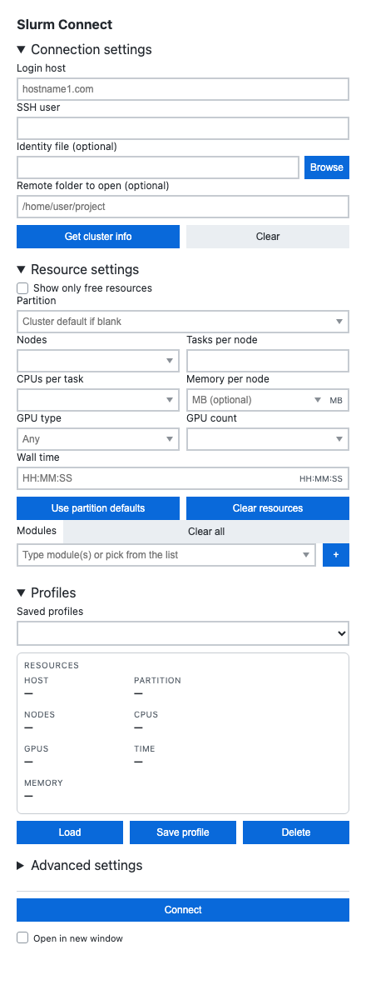
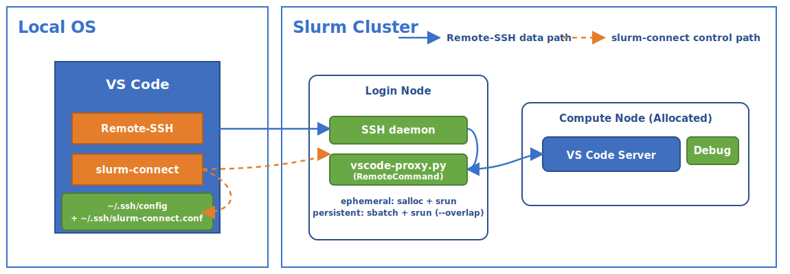

<p align="center">
  
</p>

# Slurm Connect (VS Code extension)

<a href="media/slurm-connect-ui.png"></a>

Slurm Connect helps you allocate Slurm resources on a cluster and connect VS Code Remote-SSH through a compute node.

Key features:
- One-click discovery of partitions, QoS/accounts (optional), modules, and free-resource hints.
- Persistent or ephemeral sessions, with reconnect to existing allocations.
- Automatic SSH include management for Remote-SSH (no manual host entries).
- Resource validation hints and profile support for repeatable runs.
- Module picker with paste, chips, and clear-all.
- Optional remote folder open (leave blank for an empty window) with window targeting.
- Optional local HTTP(S) proxy for outbound requests from compute nodes (proxies all non-loopback hosts).

**Requirements:**
- VS Code with **Remote - SSH** installed.
- SSH authentication configured for the cluster (SSH config or agent; agent forwarding recommended).
- Python 3.9+ available on the login nodes.
- Bundled `vscode-proxy.py` auto-installed to `~/.slurm-connect/vscode-proxy.py` on connect (can be disabled).
- Windows note: Slurm Connect follows Remote-SSH's SSH client selection. If Remote-SSH picks Git's `ssh.exe`, the extension may prompt to switch to Windows OpenSSH so `ssh-agent` works reliably.

**Install:**
- VS Code Marketplace: [Slurm Connect](https://marketplace.visualstudio.com/items?itemName=xangma.slurm-connect)
- VS Code CLI:
  ```bash
  code --install-extension xangma.slurm-connect
  ```

**Quick start:**
1. Install Slurm Connect from the marketplace (or with the CLI command above).
2. Open the **Slurm Connect** view from the activity bar.
3. Select a login host (or pick from SSH config), username if needed, and an optional identity file.
4. Click **Get cluster info**, choose resources, then **Connect**.
5. While connecting, the button changes to **Cancel** so you can abort before Remote-SSH starts.

The extension queries the login host, writes a Slurm Connect SSH include file, ensures your SSH config contains a small managed Slurm Connect Include block (with a note), and connects. It does not replace your SSH config. On Windows, the Include path stays in its configured form (default `~/.ssh/slurm-connect.conf`) for compatibility with both native and POSIX-style SSH clients. Local Slurm Connect logs are capped (currently 5 MB) to avoid unbounded growth.

Profiles store the values you edit in the Slurm Connect view (connection, resources, and advanced fields). The local proxy enable and proxy debug logging toggles are in the view. Advanced local proxy settings and other global-only settings like SSH host prefix, managed include path, session state directory, proxy auto-install, SSH query config, and SSH host key checking live in VS Code Settings under `slurmConnect`.

**How it works:**


The diagram above was inspired by the [VS Code Remote-SSH architecture diagram](https://code.visualstudio.com/docs/remote/ssh).

**Troubleshooting:**
- In the Slurm Connect view, use **Advanced > Open logs** for extension logs and **Remote-SSH log** for transport errors.
- If authentication or host-key checks fail, review [docs/ssh.md](docs/ssh.md).
- For command/setting mismatches, review [docs/settings.md](docs/settings.md) and confirm your `slurmConnect` settings.

**Security and footprint:**
- Slurm Connect adds a small managed `Include` block in your SSH config and writes generated hosts to `~/.ssh/slurm-connect.conf` (or your configured include path).
- On the cluster, it can manage `~/.slurm-connect/vscode-proxy.py` and proxy logs under `~/.slurm-connect/`.
- Local proxy support is optional and proxies non-loopback traffic only; loopback targets (`localhost`, `127.0.0.1`, `::1`) are never proxied.

**Uninstall and cleanup:**
1. Uninstall the extension from VS Code.
2. Remove the managed Slurm Connect `Include` block from your SSH config if you no longer need generated hosts.
3. Remove the generated include file (default `~/.ssh/slurm-connect.conf`) if you no longer need it.
4. Optionally remove `~/.slurm-connect/` on cluster login nodes to delete the installed proxy script/logs.

**QR links:**

| Marketplace | GitHub |
|---|---|
|  |  |
| [Marketplace page](https://marketplace.visualstudio.com/items?itemName=xangma.slurm-connect) | [GitHub repo](https://github.com/xangma/slurm-connect) |

**Docs:**
- Usage and UI reference: [docs/usage.md](docs/usage.md)
- Cluster info and free-resource filtering: [docs/cluster-info.md](docs/cluster-info.md)
- SSH and authentication (`ssh-agent`, step, additional options, proxy command): [docs/ssh.md](docs/ssh.md)
- Persistent sessions: [docs/persistent-sessions.md](docs/persistent-sessions.md)
- Settings reference: [docs/settings.md](docs/settings.md)

**Contributing and development:**
- Install dependencies: `npm install`
- Compile: `npm run compile`
- Test: `npm test`
- Optional UI screenshot refresh: `npm run screenshot:webview -- --out media/slurm-connect-ui.png`
- Project metadata: [CHANGELOG.md](CHANGELOG.md), [LICENSE](LICENSE)
